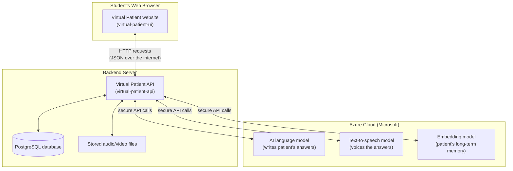
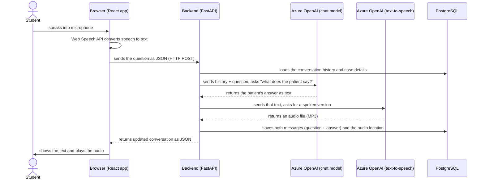
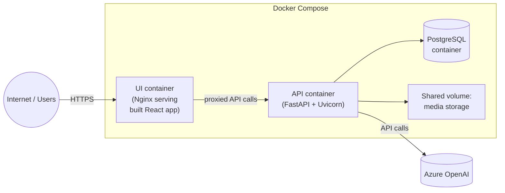

# Virtual Patient — Full Architecture Guide (Beginner-Friendly)

This document explains, from the ground up, how the Virtual Patient platform is
built and how all its pieces fit together. It assumes no prior knowledge of the
specific technologies used — each one is introduced in plain language before
explaining how this project uses it.

---

## 1. What This Application Does

Virtual Patient is a training tool for medical students. A student "interviews" a
simulated patient (an AI role-playing a clinical case) through a chat-like
interface, using voice or text. The system:

- Generates realistic patient answers using an AI language model.
- Speaks those answers back with synthesized voice (text-to-speech).
- Records the whole session (student's mic/camera + patient's audio) for later review.
- Analyzes the student's voice tone and facial expressions for coaching feedback.
- Lets the student submit diagnostic hypotheses and get an evaluation/summary.

It is a **two-part system**:

| Part | Folder | What it is |
|---|---|---|
| Backend / API | `virtual-patient-api/` | The "brain" — runs the AI, talks to the database, does all heavy processing |
| Frontend / UI | `virtual-patient-ui/` | The website the student uses in their browser |

They communicate over the network using **HTTP requests** (the same protocol your
browser uses to load any web page), formatted as **JSON** (a simple text format
for structured data, e.g. `{"content": "hello"}`).

---

## 2. The Big Picture



Everything the student sees runs in their browser. Everything involving AI,
data storage, and business rules runs on the backend server, which in turn
calls out to Microsoft Azure's AI services to generate text and speech.

---

## 3. Key Technologies, Explained

### 3.1 Backend technologies

**Python** — the programming language the entire backend is written in. Popular
for AI/data-heavy applications because of its simplicity and rich ecosystem.

**FastAPI** — a Python framework for building web APIs (the set of "endpoints"
the frontend calls, like `POST /medical-interviews/{id}/messages`). Think of it as
the switchboard that receives a request from the browser, decides what to do,
and sends back a response. It also auto-generates interactive API documentation
(visible at `/docs` on the running server).

**Uvicorn** — the lightweight web server that actually runs the FastAPI
application and listens for incoming network connections.

**PostgreSQL** — the relational database where all persistent information is
stored: user accounts, clinical cases, interview messages, recordings metadata,
evaluation results, etc. Think of it as a collection of very organized
spreadsheets ("tables") with strict rules about what can go in each column.

**SQLAlchemy** + **Alembic** — SQLAlchemy is an "ORM" (Object-Relational
Mapper): it lets Python code work with database rows as if they were normal
Python objects, instead of writing raw SQL by hand. Alembic manages **database
migrations** — versioned, incremental scripts that evolve the database
structure over time (the `alembic/versions/*.py` files, each one is one
incremental change, e.g. "add an `audio_url` column").

**pgvector** — a PostgreSQL extension that lets the database store and search
**vector embeddings** (see below) — this powers the "long-term memory" feature
of the virtual patient.

**JWT (JSON Web Tokens)** — the authentication mechanism. When a user logs in,
the server gives them a signed token; the browser then attaches this token to
every subsequent request (like a stamped ID badge) so the server knows who is
asking and what they're allowed to do.

**LangChain** and **LangGraph** — frameworks for building applications powered
by large language models (LLMs):
- **LangChain** provides building blocks: a standard way to call an LLM, format
  prompts, manage conversation messages, etc.
- **LangGraph** lets you build the AI logic as a **graph/state machine** —
  a flowchart of steps ("nodes") the conversation goes through, with the
  ability to save/resume progress ("checkpoints") and remember things over
  time. In this project, `VirtualPatientWorkflow` is exactly such a graph:
  step 1 asks the AI to role-play the patient, step 2 translates/adjusts the
  response, etc.

**Azure OpenAI** — Microsoft's cloud service that hosts OpenAI's AI models
(the same technology behind ChatGPT) under Microsoft's infrastructure and
compliance umbrella. This project uses three different capabilities from it:
  1. **Chat/completion model** (`gpt-4o-mini`) — generates what the patient says.
  2. **Text-to-speech model** (`gpt-4o-mini-tts`) — converts that text into a
     realistic-sounding voice recording (an MP3 file).
  3. **Embedding model** (`text-embedding-3-small`) — turns text into a list of
     numbers ("vector embedding") that captures its *meaning*, so the system
     can later search "what did we already discuss that's similar to this new
     question?" This is what gives the virtual patient a form of long-term
     memory across a long conversation.

**Vector embeddings / semantic memory**, explained simply: imagine converting
every sentence into a point in space, where sentences with similar meaning end
up near each other. To "remember" something relevant, the system just looks
for the nearest points to the current question. This is stored in Postgres via
`pgvector` and orchestrated by LangGraph's memory store.

**OpenSMILE** — a specialized audio-analysis toolkit (not AI-generated, purely
signal processing) used here to measure *how* the student spoke — pitch,
loudness, pauses, energy — not *what* they said. This is used for coaching
feedback on communication style ("paraverbal" analysis).

**OpenFace 3.0 / PyFeat** — computer-vision toolkits that analyze video frames
of the student's face: head position, facial-muscle movements ("Action
Units"), etc. This is the "nonverbal" analysis, e.g. detecting nodding or
engagement cues. This is research/experimental in the current system.

**Google Cloud Storage (GCS)** *(optional)* — if configured, generated patient
audio files can be stored in Google's cloud file storage instead of the
server's local disk, for durability at scale.

**Docker** — a way to package the whole application (code + all its exact
dependencies) into a "container" that runs identically on any machine. The
`Dockerfile` in each folder describes how to build that package; the
`docker-compose.*.yml` files describe how to run several containers together
(the API, the database, the frontend) as one coordinated system.

### 3.2 Frontend technologies

**TypeScript** — JavaScript (the language browsers run) with an added type
system, which helps catch bugs before the code even runs.

**React** — a library for building interactive user interfaces out of
reusable "components" (e.g. `ChatInterface`, `ChatMessages`). Each component
is a self-contained piece of UI plus its own logic.

**Vite** — the build tool that takes all the TypeScript/React source files and
bundles them into optimized JavaScript/CSS files a browser can run, plus a
fast local development server.

**Tailwind CSS** — a utility-first styling system: instead of writing custom
CSS files, developers apply small pre-defined styling classes directly in the
markup (e.g. `class="p-4 rounded-lg"`).

**i18next / react-i18next** — internationalization (i18n) library, allowing
the UI text to be translated (the project has both English and Spanish
translation files).

**Web Speech API** — a capability built into the browser itself (no server
involved) that can listen to the microphone and transcribe speech to text.
This is what powers "speech-to-text" (STT) for the student's spoken questions
— the AI backend never hears raw audio, only the transcribed text.

**MediaRecorder API / OPFS (Origin Private File System)** — browser APIs used
to record audio/video streams and store the recorded chunks temporarily
in the browser itself (`OPFS` is like a private, sandboxed hard drive just for
this website) before uploading the finished file to the server.

**Nginx** — a lightweight, high-performance web server used in production to
serve the built frontend files and to forward ("proxy") API requests to the
backend container, and to handle HTTPS/TLS.

---

## 4. Backend Structure in Detail

```
virtual-patient-api/
├── main.py                # Entry point: creates the FastAPI app, wires up all routers
├── app/
│   ├── routers/            # One file per group of HTTP endpoints (the "URLs" the frontend calls)
│   ├── controllers/        # Business logic: what actually happens when an endpoint is called
│   ├── models/              # Database table definitions (SQLAlchemy) + request/response shapes (Pydantic)
│   ├── agents/               # The AI conversation logic (LangGraph workflow, prompts, memory)
│   ├── speech/                # Text-to-speech / speech-to-text provider integrations
│   ├── media/                 # Where generated audio files are stored/streamed from
│   ├── paraverbal/            # Voice-tone analysis (OpenSMILE)
│   ├── nonverbal/             # Facial/video analysis (OpenFace, PyFeat)
│   └── core/                  # Cross-cutting concerns: settings, auth, DB connection
├── alembic/                  # Database schema version history
└── scripts/                   # One-off maintenance/setup scripts (seed data, DB setup, etc.)
```

**Request lifecycle (how a typical API call works):**

1. The browser sends an HTTP request (e.g. `POST /medical-interviews/42/messages`)
   with a JWT token in the header and a JSON body.
2. FastAPI routes it to the matching function in `app/routers/`.
3. That function calls into a **controller**, which contains the actual step-by-step
   logic (validate permissions, load data, call the AI, save results).
4. The controller reads/writes the **database** through SQLAlchemy **models**.
5. For anything involving the AI patient, the controller calls into `app/agents/`
   (LangGraph workflow) and `app/speech/` (text-to-speech).
6. The function returns a Python object; FastAPI automatically converts it to JSON
   and sends it back to the browser.

---

## 5. Frontend Structure in Detail

```
virtual-patient-ui/
├── src/
│   ├── components/     # Visual building blocks (chat screen, evaluation screen, etc.)
│   ├── services/         # Functions that call the backend API (one function per endpoint)
│   ├── hooks/             # Reusable pieces of interactive logic (e.g. "manage audio playback")
│   ├── contexts/          # App-wide shared state (e.g. "who is logged in")
│   ├── recording/          # Logic to capture mic/camera and upload recordings
│   ├── speech/              # Wrapper around the browser's built-in speech recognition
│   ├── types/                # TypeScript definitions describing the shape of data (Message, Interview, ...)
│   ├── utils/                  # Small helper functions (e.g. converting API field names)
│   └── i18n/                    # Translation text files
```

The frontend is a **Single Page Application (SPA)**: the browser loads one HTML
page, and React then swaps out components on screen as the user navigates,
without full page reloads. All data comes from calling the backend's JSON API.

---

## 6. One Full Conversation Turn, Step by Step

This is the core interaction loop, explained simply:



Behind the scenes, the "ask the AI" step actually runs a small **LangGraph
workflow** with two stages: one that generates the patient's answer (using the
clinical case description and any relevant memories from earlier in the
conversation), and one that adjusts/translates it into the right language and
tone before it's spoken aloud.

This whole round trip typically takes **1.5 to 4 seconds** (AI thinking time +
generating the voice + normal network delay).

**Important characteristic**: this is a **simple request/response** exchange
(like filling out a form and submitting it), not a live streaming
conversation. There's no continuous open connection between browser and
server for the chat itself — every turn is one self-contained HTTP request.

---

## 7. Recording and Analysis Pipeline

Separately from the chat itself, the interview screen also behaves like a
video call: it continuously records **four** synchronized streams for the full
duration of the interview:

1. **Student's microphone audio**
2. **Student's webcam video**
3. **Patient's synthesized voice audio** (as it plays)
4. **The patient's on-screen avatar/UI**, captured as if it were a video

These are recorded **inside the browser** (temporarily saved to a private,
sandboxed area of the browser's storage), then uploaded to the server once the
interview ends. After finalizing:

- **OpenSMILE** measures voice-tone characteristics from the student's audio
  (pace, pauses, energy) — this is the "paraverbal" analysis.
- **OpenFace 3.0** / **PyFeat** analyze the student's video for head position
  and facial cues — this is the "nonverbal" analysis.

These results are attached to each conversational "turn" in the database and
shown later in a post-interview **recap** view, alongside a synchronized replay
of both video panels and the transcript.

---

## 8. Deployment & Infrastructure



- **Local development** (`docker-compose.local.yml`, `deploy-local.sh`): runs
  Postgres + API + UI containers on your own machine, without HTTPS, for
  building/testing.
- **Full deployment** (`docker-compose.full.yml`, `deploy-full.sh`,
  `setup-tls.sh`): the production setup, including HTTPS/TLS certificates.
- Configuration (database passwords, Azure API keys, feature flags) is
  supplied via `.env` files — never hard-coded in the source code.
- The database schema is created and evolved through **Alembic migrations**,
  applied automatically or via a setup script.

---

## 9. Glossary (Quick Reference)

| Term | Plain-language meaning |
|---|---|
| API | A defined set of "requests" one program can send to another to get data or trigger actions |
| Endpoint | One specific URL + action the API supports (e.g. "create an interview") |
| REST / HTTP request | The standard way browsers and servers exchange requests/responses over the web |
| JSON | A simple text format for structured data, e.g. `{"name": "Ana"}` |
| Backend | The server-side program: business logic, database, AI calls |
| Frontend | The program that runs in the user's browser: what they see and click |
| Database / PostgreSQL | Where all persistent data is stored in organized tables |
| ORM (SQLAlchemy) | Lets code manipulate database rows as normal programming objects |
| Migration (Alembic) | A versioned, incremental change to the database's structure |
| LLM (Large Language Model) | The AI model that generates human-like text (e.g. the patient's answers) |
| TTS (Text-to-Speech) | AI/technology that turns written text into a spoken audio recording |
| STT (Speech-to-Text) | Technology that turns spoken audio into written text |
| Embedding / vector | A list of numbers representing the "meaning" of a piece of text, used for similarity search |
| LangChain / LangGraph | Developer frameworks for building AI-agent applications and conversation workflows |
| JWT | A secure, signed token proving who a logged-in user is |
| Docker / container | A packaged, portable way to run software so it behaves the same everywhere |
| Nginx | A web server commonly used to serve files and route/proxy requests |
| SPA (Single Page Application) | A website that loads once and updates itself dynamically instead of reloading pages |
| OPFS | A private, sandboxed file storage area inside the browser |
| Paraverbal analysis | Measuring *how* someone speaks (tone, pace, pauses) rather than *what* they say |
| Nonverbal analysis | Measuring facial/body cues from video (head pose, expressions) |

---

## 10. Summary for a Non-Technical Reader

Think of the system as a **call center with an AI agent**:

- The **frontend** is the phone/headset the student uses — it listens, talks,
  and shows a transcript.
- The **backend** is the call center's operations: it takes the transcribed
  question, looks up the "script" (clinical case) and conversation history,
  asks a smart assistant (Azure's AI) what the patient would say, converts that
  answer into a voice recording, and sends everything back.
- The **database** is the filing cabinet holding every transcript, case,
  recording reference, and evaluation result.
- **Docker** is the shipping container that lets this whole call center be set
  up identically on any computer or server.
- The **recording and analysis pipeline** is like a training supervisor
  quietly reviewing the call afterward, measuring tone of voice and body
  language to give the student feedback.
