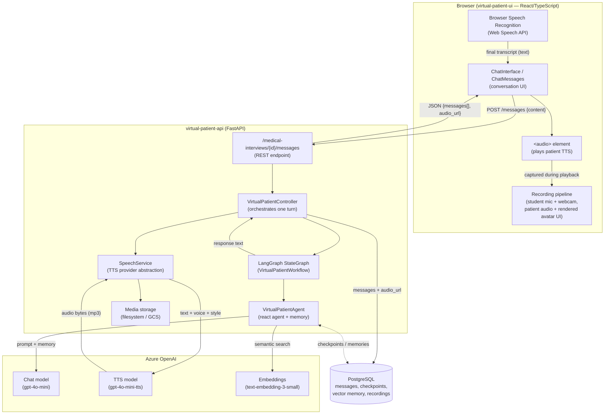
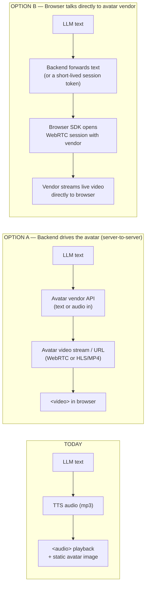
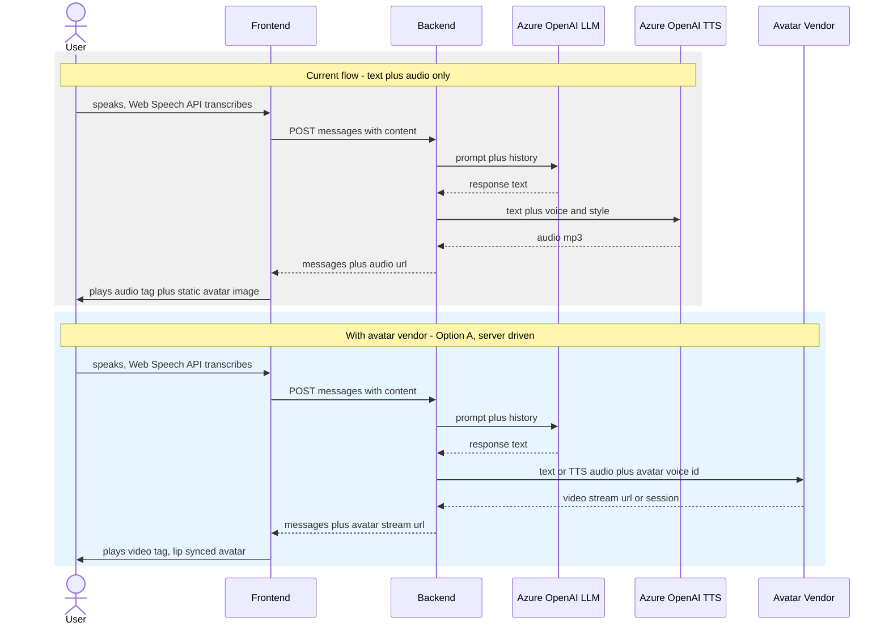

# Virtual Patient — Architecture Overview for Conversational Avatar Selection

This document explains how the Virtual Patient platform is built today, so that an
external partner can evaluate where and how to plug in a conversational avatar
service (e.g. **Tavus**, **Azure AI Speech Avatar**, **HeyGen Streaming Avatar**,
**D-ID Agents**, etc.).

---

## 1. Current System Architecture

**Key characteristics:**

| Aspect | Current implementation |
|---|---|
| Transport | Plain REST (HTTP POST/GET), **no WebSocket / streaming**, one request per turn |
| "Face" of the patient | A static UI component (photo/avatar image), **no lip-synced video** |
| Voice | Azure OpenAI TTS (`gpt-4o-mini-tts`), returned as an MP3 file, played via `<audio>` |
| STT | Done **in the browser** (Web Speech API) — text only reaches the backend |
| Turn latency | LLM (~0.5–1.5s) + TTS (~0.5–2s) + network ≈ 1.5–4s per turn |
| Recording | Browser captures 4 separate tracks (student audio/video, patient audio, rendered patient UI) client-side and uploads them after the interview |

---

## 2. Where a Conversational Avatar Fits In

Adding a talking avatar (video with lip-sync) means replacing the "static photo +
audio tag" step with a **video stream** synchronized to the generated speech. There
are two integration patterns, depending on the vendor:

### Option A — Server-driven avatar (backend calls the vendor)
- The backend (`SpeechService`) is replaced/extended: instead of only calling Azure
  TTS, it calls the avatar vendor's API with the LLM's text (or the already-generated
  audio), and gets back a video (file, HLS stream, or WebRTC offer).
- Works with vendors like **Azure AI Speech Avatar** (batch or real-time synthesis)
  or **Tavus** (Conversational Video Interface / CVI in "replica speaks text" mode).
- Simpler to secure (API keys stay server-side) and easiest to keep the existing
  recording pipeline (patient video can be captured the same way as today).
- Adds backend latency/complexity for real-time streaming (may need WebSocket or
  WebRTC termination on the server).

### Option B — Client-driven avatar (browser talks to vendor directly)
- The backend only produces the **text** (skips its own TTS step) and optionally a
  short-lived token/session id from the vendor.
- The browser uses the vendor's JS SDK to open a **WebRTC** session directly with
  the vendor's edge network (lowest latency, natural for "real-time conversation"
  products like **Tavus**, **HeyGen Streaming Avatar**, **D-ID Agents**).
- Requires exposing a vendor session/token endpoint from the backend, and changing
  the frontend `ChatInterface` to render a `<video>`/WebRTC element instead of
  `<audio>`.
- The "patient video" recording capture (today done by canvas-capturing a React
  component) would instead capture the `<video>` element receiving the vendor
  stream.

---

## 3. Sequence Diagram — Current Turn vs. Avatar-Enabled Turn

---

## 4. Integration Considerations by Vendor Type

| Criteria | Azure AI Speech Avatar | Tavus (CVI) | HeyGen Streaming Avatar | D-ID Agents |
|---|---|---|---|---|
| Streaming protocol | WebRTC (real-time) or batch (pre-rendered video) | WebRTC (real-time conversational replica) | WebRTC | WebRTC |
| Where session is created | Can be server-side (Speech SDK) | Vendor recommends creating the "conversation" server-side, client joins via SDK | Session token via server, client renders via SDK | Session created server-side, client streams via SDK |
| Fits current stack | Easiest — same Azure account/billing as existing Azure OpenAI usage; can keep using Azure OpenAI LLM text as input | Needs new vendor account; can keep existing LLM, feed text to Tavus persona | Needs new vendor account; similar integration effort | Needs new vendor account |
| Latency profile | Low (Microsoft edge network), good for real-time | Low, optimized for real-time conversation | Low-moderate | Moderate |
| Where to change code | `app/speech/` (new provider next to `azure_openai.py`), `ChatInterface.tsx` (render video) | Same — new provider module + frontend video element | Same | Same |
| Recording pipeline impact | Capture `<video>` element instead of canvas-rendering the static avatar | Same | Same | Same |
| Custom voice / personality reuse | Can reuse existing Azure voice/vocal-style policy (`vocal_style_policy.py`) | Vendor has its own voice; may lose current personality-based prosody control unless vendor supports custom TTS input | Vendor-specific voice, some support custom audio input | Vendor-specific voice |

---

## 5. Recommended Decision Points for the Customer

1. **Do you want the backend or the browser to hold the avatar session?**
   - Backend-driven (Option A) keeps API keys secret and reuses today's
     `SpeechService` abstraction pattern — lower blast radius change.
   - Client-driven (Option B) gives lowest latency but requires a new
     session/token endpoint and CORS/security review for the vendor's SDK.

2. **Do you need to keep the current personality-based voice control**
   (`vocal_style_policy.py`, speaking rate/tone/hesitation per personality)?
   - If yes, prefer vendors that accept **pre-generated audio** as input
     (so Azure OpenAI TTS output can drive the avatar's lip-sync), rather than
     vendors that only accept text and use their own voice.

3. **Recording/compliance requirements** — the current system captures and stores
   4 synchronized media tracks per interview for pedagogical review. Any avatar
   vendor chosen must allow the resulting video stream to be captured
   (e.g. via `MediaRecorder` on the `<video>` element) for this to continue working.

4. **Cost/latency trade-off** — real-time WebRTC avatars (Tavus, HeyGen, D-ID,
   Azure real-time) add continuous per-minute streaming cost vs. today's
   pay-per-message TTS cost.
